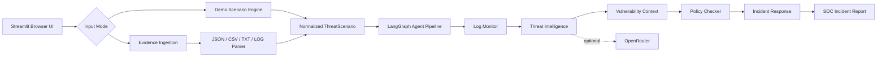

# SentinelMesh AI

SentinelMesh AI is a cybersecurity AI agent app for read-only incident
analysis. It supports built-in demo scenarios and browser-provided evidence,
routes normalized events through a multi-agent pipeline, and generates SOC-style
incident reports with optional OpenRouter enrichment.

## Status

Ready for local demo and GitHub upload.

Not production-deployed yet. The current production-leaning slice analyzes
uploaded or pasted security evidence in read-only mode. It does not connect to
live systems, run real scanners, or execute containment actions.

## What It Demonstrates

- Log Monitor Agent for suspicious auth, network, API, endpoint, and cloud events.
- Threat Intelligence Agent for MITRE ATT&CK and reputation-style context.
- Vulnerability Scanner Agent for simulated code, API, cloud, and endpoint gaps.
- Policy Checker Agent for NIST, ISO 27001, and SOC 2 control gaps.
- Incident Response Agent for safe containment and recovery plans.
- Streamlit SOC console for scenario selection, timelines, charts, and reports.
- Browser upload and paste modes for local security evidence analysis.

## Architecture



More detail: [docs/architecture.md](docs/architecture.md)

## Scenarios

| Scenario | Description |
| --- | --- |
| `brute_force_attack` | Brute force against admin accounts from botnet IPs, account compromise, lateral movement |
| `insider_threat` | Employee escalates privileges, accesses sensitive APIs, exfiltrates data via cloud storage |
| `api_key_compromise` | Leaked production API key used from foreign IP for mass data extraction |
| `malware_lateral_movement` | Phishing leads to beaconing, credential dumping, PsExec lateral movement, C2 traffic |
| `cloud_misconfiguration` | Public storage and broad network exposure leading to sensitive data access |

## Setup

Use Python 3.11 or 3.12.

```bash
python3.12 -m venv .venv
.venv/bin/python -m pip install -r requirements.txt
cp .env.example .env
```

Set your OpenRouter key in `.env` or your shell:

```bash
export OPENROUTER_API_KEY="your-key"
export OPENROUTER_MODEL="openai/gpt-5-mini"
```

The app runs without a key by using deterministic fallback summaries.

## Run

```bash
.venv/bin/streamlit run streamlit_app.py
```

Open:

```text
http://localhost:8501
```

## Analyze Browser-Provided Evidence

The app has three input modes in the sidebar:

- `Demo scenario`: uses the built-in simulated incidents.
- `Upload evidence`: accepts `.json`, `.csv`, `.txt`, and `.log` security files.
- `Paste evidence`: accepts one or more pasted security log lines.

Uploaded and pasted evidence is analyzed locally in memory. The app does not
write uploaded files to disk and does not execute real containment actions.

Structured JSON or CSV evidence can include these fields:

```text
timestamp, kind, actor, source_ip, asset_id, action, outcome, severity, message, indicators
```

Example pasted log:

```text
admin login failed from 185.220.101.34 after brute force attempts
prod-api-key bulk read from 45.83.64.12 caused mass extraction
sensitive bucket public access observed from 203.0.113.77
```

Sample upload files are available in [sample_evidence](sample_evidence).

Command-line report:

```bash
.venv/bin/python main.py brute_force_attack --no-llm
```

## Verify

```bash
.venv/bin/python -m pytest -v
.venv/bin/python -m compileall sentinelmesh main.py streamlit_app.py
.venv/bin/black --check .
.venv/bin/flake8 .
```

## Repository Layout

```text
sentinelmesh/
  agents/          LangGraph-compatible pipeline orchestration
  ingestion/       Browser upload and pasted evidence parsers
  models/          Pydantic event and report models
  simulators/      Built-in demo threat scenarios
  tools/           Deterministic analysis and OpenRouter helpers
tests/             Pytest coverage for scenarios, ingestion, analysis, pipeline
sample_evidence/   JSON, CSV, and text files for upload demos
docs/              Architecture and implementation notes
```

## Environment Variables

| Variable | Description | Default |
| --- | --- | --- |
| `OPENROUTER_API_KEY` | OpenRouter API key | empty |
| `OPENROUTER_BASE_URL` | OpenRouter API base URL | `https://openrouter.ai/api/v1` |
| `OPENROUTER_MODEL` | LLM model through OpenRouter | `openai/gpt-5-mini` |
| `OPENROUTER_TIMEOUT` | Request timeout in seconds | `20` |

## Production Roadmap

- Real SIEM/log collector integrations.
- NVD/CVE and vendor advisory ingestion.
- Source code, Dockerfile, IaC, API spec, and dependency scanning.
- Container image, dependency, API, and IaC scanner integrations.
- Evidence store with incident history and audit trail.
- Human approval workflow for containment actions.
- Export to ticketing, Slack, Teams, and SOC case-management tools.

## GitHub Upload Checklist

```bash
git status --short
.venv/bin/python -m pytest -v
.venv/bin/python -m compileall sentinelmesh main.py streamlit_app.py
.venv/bin/black --check .
.venv/bin/flake8 .
git add .
git commit -m "feat: add sentinelmesh ai cybersecurity demo"
```
