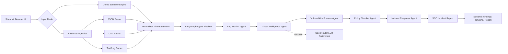

# SentinelMesh AI Architecture

SentinelMesh AI is a read-only cybersecurity analysis app. It supports two
paths: built-in demo scenarios and browser-provided security evidence.

## Security Boundary

- Uploaded evidence is parsed in memory.
- Uploaded files are not written to disk.
- The app does not execute containment actions.
- OpenRouter enrichment is optional and only receives summarized incident
  context, not raw uploaded files.
- Production integrations should add approval gates and audit logging before
  any real containment workflow.

## Extension Points

- Add SIEM collectors before the ingestion layer.
- Add scanner-specific parsers for code, Docker, IaC, and dependency evidence.
- Add a persistent evidence store after normalization.
- Add human approval workflows before containment actions.
